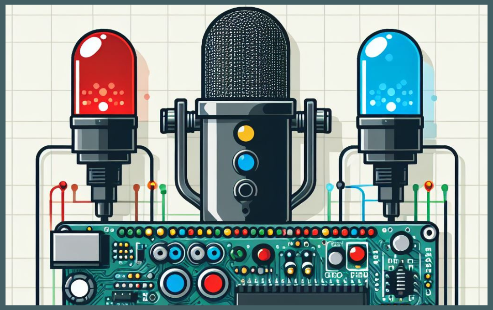
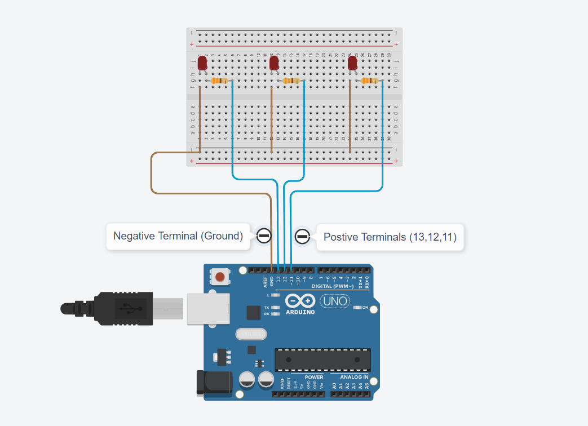
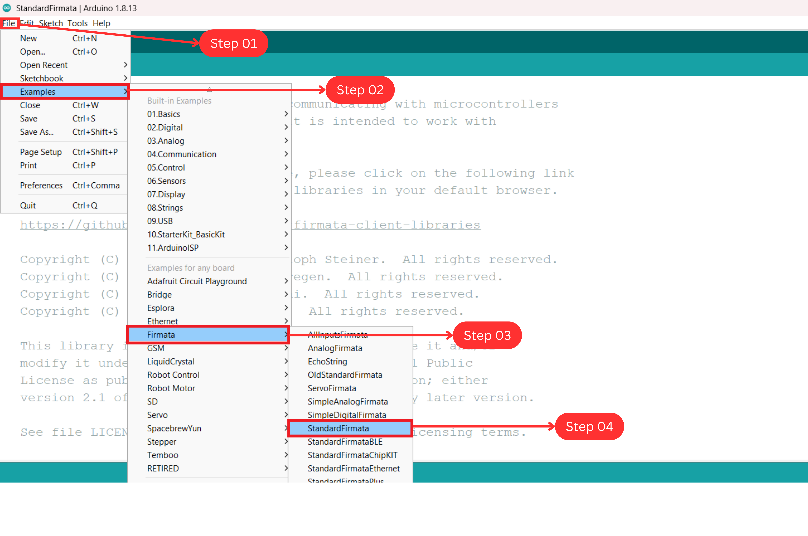
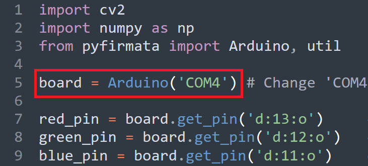

# AI Voice AutoLight System

## Repo Structure

```
├── docs                                   # Documents
├── research                               # Pre-research experiments
├── source                                 # Project source code
│   ├── modules                            # Custom dependencies
│   └── main.py                            # Main entry point
└── README.MD                              # README content
```

## 01 Introduction

This is an automated lighting control system that operates automatically and is powered by Arduino and Artificial Intelligence. It utilizes AI technology to recognize speech and automate lighting operations. The system uses the Firmata protocol to enable Python to communicate with Arduino, thereby turning on LEDs with the help of speech recognition technology.



## 02 Technology Stack

### 2.1 Hardware Stack

- Arduino UNO
- LED: Red, Green, Blue
- Full breadboard
- Jumper Wires

### 2.2 Software Stack

- Python 3.8.5 (Recommended)
- Arduino IDE (Framework)
- SpeechRecognition
- PyAudio
- PyFirmata

## 03 Setup

### 3.1 Hardware Setup



| LEDs          | Pin No  |
| ------------- | ------- |
| **RED LED**   | Pin: 13 |
| **Green LED** | Pin: 12 |
| **Blue LED**  | Pin: 11 |

### 3.2 Firmware Setup

Setting up the Arduino firmware is necessary to enable communication between Python and Arduino. The Firmata protocol establishes serial communication between a Python script and an Arduino.

To upload Firmata, open Arduino IDE and choose the correct COM port and **File -> Examples -> Firmata -> StandardFirmata -> Upload to Arduino UNO Board**.



**Note:** After uploading StandardFirmata to the Arduino Board, Python can be used to program it.

### 3.3 Software Setup

We will now install the necessary tools to gain access to the Arduino Board. This project utilizes essential libraries, including Speech Recognition and PyFirmata. We need to install all the required dependencies on the development computer.

- **Step 01:** Install Python.

  ```
  Ver: 3.8.5 is recommended (www.python.org).
  ```

- **Step 02:** Navigate to the repo root in a terminal.

  ```
  ai-speech-voice-system/
  ```

- **Step 03:** Install dependencies.

  ```
  pip install -r requirements.txt
  ```

## 04 Usage

- **Source Directory:**

  ```
  ai-speech-voice-system/source/main.py
  ```

### 4.1 Steps to run

- **Step 01:** Connect the Arduino to the development computer.

- **Step 02:** Set the Arduino serial port.

  You can either update the `ARDUINO_PORT` environment variable (recommended) or modify the script directly.

  ```
  ARDUINO_PORT=COM4 python source/main.py
  ```

  

- **Step 03:** Run the app.

  ```
  python source/main.py
  ```

### 4.2 Output

[4-demo-video.webm](https://github.com/gunarakulangunaretnam/ai-speech-autolight-system/assets/45822509/9ef5b3f7-ffd7-4c2d-92b6-1e402a64fe6d)


# Contact

### 🌐 Website:
[](https://www.mpowerr.com)

---

### 📱 Social Media:

[](https://www.linkedin.com/company/mpowerr-info)
[](https://www.facebook.com/mpowerr.info)
[](https://www.instagram.com/mpowerr.info)
[](https://x.com/MpowerrInfo)
[](https://www.tiktok.com/@mpowerr.info)
[](https://www.youtube.com/@mpowerrinfo)

---
